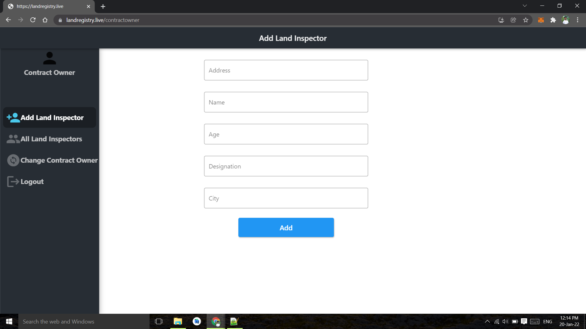
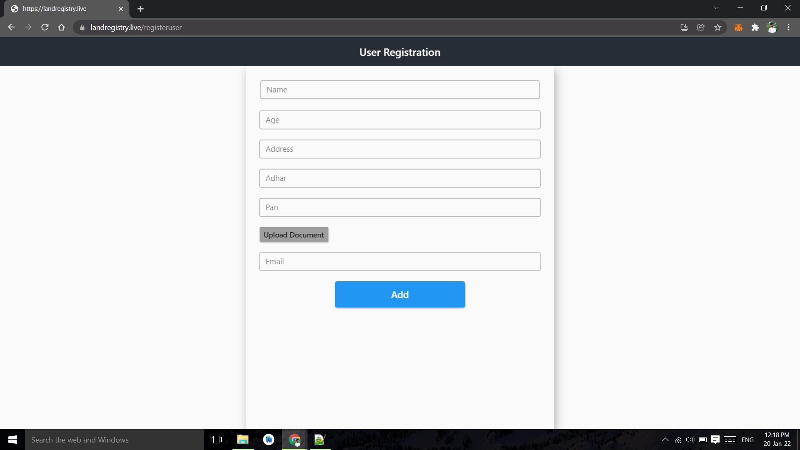
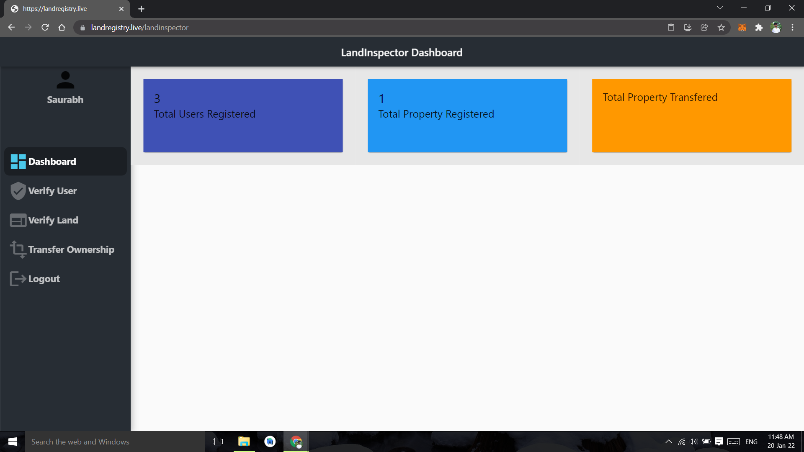
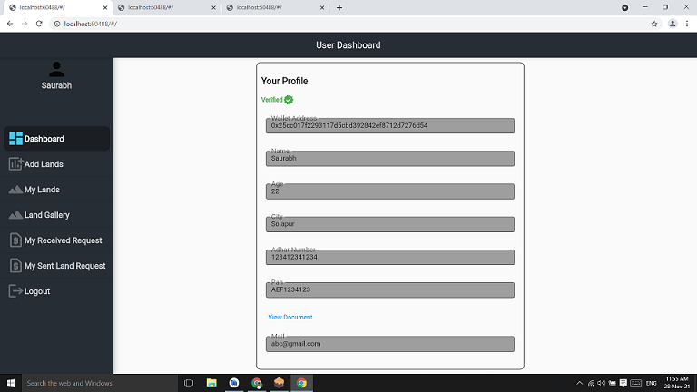

## Enregistrement de propriété basé sur la blockchain

## Enregistrement foncier à l'aide de Blockchain

Problème qu'il résout :

1.) Suppression des intermédiaires.
La suppression des intermédiaires ou des courtiers rend le processus moins coûteux. Les courtiers essayant de tromper les personnes sans instruction ne pourront plus le faire. Les courtiers prennent souvent beaucoup de temps pour terminer les procédures et notre projet fera donc également gagner du temps aux gens.

2.) Grand livre inviolable distribué qui empêche toute fraude à la propriété.

3.) Stockage sécurisé des documents d'enregistrement de propriété sensibles à l'aide d'IPFS.

Technologies utilisées :

Ethereum Blockchain
Aurora
Web3Dart
IPFS
Flutter
Metamask

Démo

Vidéo de démonstration de notre Dapp ici

Exécuter l'application localement

1.Clonez le référentiel github et cd dans le dossier
2.Installez flutter, nodejs
3.Installez ganache et truffle

npm install -g truffle

4.Ouvrez Ganache et laissez-le fonctionner en arrière-plan 5.Installez l'extension chrome Metamask, choisissez le réseau local et importez les comptes 6.Compilez et exécutez nos migrations à partir de la ligne de commande comme ceci

truffle compile
truffle migrate

6. Copiez l'adresse du contrat et collez-la dans ./lib/constant/constant.dart - 'contractAddress'
7. Dans le fichier constant.dart, changez chainId en '1337' et changez 'rpcUrl' en " http://127.0.0.1:7545 "
8. Exécutez l'application Web flutter

flutter run -d web-server --web-port 5555

9.Ouvrez le navigateur et le dapp s'exécutera dans http://localhost:5555/

## Organigramme du projet

## Screenshots
Home Page                   |                   Wallet connect/Login
:---------------------------------:        |      :------------------------------:
  |

Contract Owner Dashboard               |                   User Registration
:---------------------------------:        |      :------------------------------:
  |

Land Inspector Dashboard                   |                  User Verification 
:---------------------------------:        |      :------------------------------:
     |

User Dashboard               |                  Adding land on Map    
:---------------------------------:        |      :------------------------------:
     |

Land Gallery                |                   Land Details    
:---------------------------------:        |      :------------------------------:
     |

Received Request           |                   Make Payment  
:---------------------------------:        |      :------------------------------:
     |

Transfer ownership,Seller,buyer photo capture   |                Witness info,photo capture,transfer ownership 
:---------------------------------:        |      :------------------------------:
     |
